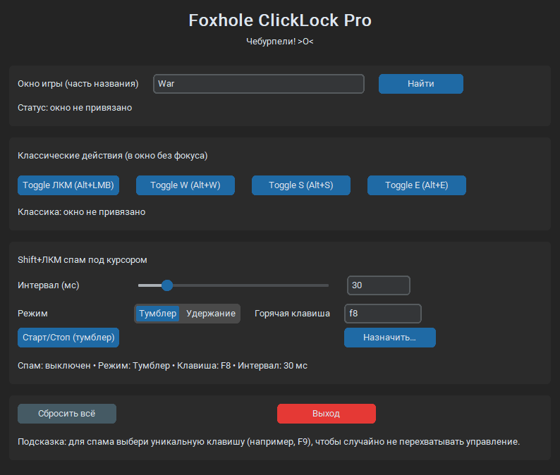

# ClickLock (Foxhole Helper) — Auto Click & Key Presser

Небольшой инструмент под Windows, который помогает автоматизировать однотипные действия в **Foxhole**.  
Программа выполняет **только одно действие за раз** (по согласованию с разработчиками игры), поэтому **не является полной автоматизацией**.

---

## ✨ Возможности

### 🔹 Классические удержания (в окно, без фокуса)
- **Alt + ЛКМ** — зажим ЛКМ  
  *(отправляет `WM_LBUTTONDOWN` / `WM_LBUTTONUP` в окно игры)*
- **Alt + W / S / E** — зажим соответствующих клавиш  
  *(отправляет `WM_KEYDOWN` / `WM_KEYUP` в окно игры)*

### 🔹 Спам Shift + ЛКМ под курсором
- Клики ЛКМ с зажатым **Shift** прямо **под текущим курсором**.
- Настраиваемый **интервал кликов** *(по умолчанию — **30 мс**)*.
- Возможность переназначить **любую горячую клавишу** для запуска.
- Поддержка двух режимов:
  - **Тумблер** — включается/выключается нажатием.
  - **Удержание** — кликает только пока зажата назначенная клавиша.

### 🔹 Современный интерфейс
- Построен на **CustomTkinter**.
- Подсветка активных действий:
  - зелёная индикация;
  - мягкая “дыхательная” анимация активных кнопок.
- Отображение текущего статуса, интервала, активного режима и горячих клавиш.

---

## ⌨️ Горячие клавиши (по умолчанию)

| Действие                | Комбинация          | Описание                          |
|------------------------|---------------------|-----------------------------------|
| Зажать ЛКМ             | **Alt + ЛКМ**      | Вкл/выкл удержание ЛКМ            |
| Зажать W               | **Alt + W**        | Вкл/выкл удержание W              |
| Зажать S               | **Alt + S**        | Вкл/выкл удержание S              |
| Зажать E               | **Alt + E**        | Вкл/выкл удержание E              |
| Спам Shift+ЛКМ         | **F8**             | Вкл/выкл спам (по умолчанию)      |

> ⚠️ **Совет:** назначай для спама **уникальную клавишу** (например, F9), чтобы не перехватывать управление.

---

## 🚀 Установка и запуск

1. Перейди в раздел **[Releases](../../releases)**.
2. Скачай последнюю версию `ClickLock2.exe`.
3. Запусти файл *(рекомендуется **от имени администратора** для корректной работы глобальных хоткеев)*.

---

## ❓ Частые вопросы

**Q:** Alt+ЛКМ не срабатывает  
**A:** Запусти программу от администратора. Убедись, что окно игры найдено и привязано.

**Q:** Хочу другой хоткей для спама  
**A:** В интерфейсе нажми кнопку “Назначить…” и просто нажми нужную клавишу.

**Q:** Можно ли использовать это в других играх?  
**A:** Технически да, но инструмент оптимизирован под Foxhole.

---

## ⚠️ Дисклеймер

Инструмент выполняет **только одно действие за раз** и создавался специально для Foxhole, чтобы не нарушать правила игры.  
Используй на свой страх и риск, соблюдай правила сервера и игры.

---

## 📜 Лицензия

MIT © 2025 [ajioe1111](https://github.com/ajioe1111)
