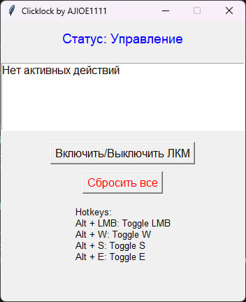

# AutoClicker & Key Presser



## Описание

**AutoClicker & Key Presser** — это удобный инструмент для автоматизации нажатий мыши (ЛКМ) и удержания клавиш (`W`, `S`, `E`) в фоновом режиме. Подходит для игр или приложений, где требуется долгое удержание действий.

Программа имеет графический интерфейс, который позволяет:
- Включать/выключать удержание ЛКМ.
- Удерживать клавиши `W`, `S`, и `E` с помощью сочетаний клавиш.
- Отображать текущие активные действия.
- Сбрасывать все удержания одной кнопкой.
- Поддерживает горячие клавиши для управления.

## Скриншот интерфейса


---

## Возможности

- **ЛКМ**: Удержание нажатия ЛКМ в указанном окне.
- **Горячие клавиши**:
  - `Alt + ЛКМ`: Включает/выключает удержание ЛКМ.
  - `Alt + W`: Удержание клавиши `W`.
  - `Alt + S`: Удержание клавиши `S`.
  - `Alt + E`: Удержание клавиши `E`.
- **Список активных действий**: Интуитивный интерфейс показывает, какие действия активны.
- **Кнопка сброса**: Быстро завершает все удержания.

---

## Установка

1. **Клонируйте репозиторий**:
   ```bash
   git clone https://github.com/ajioe1111/autoclicker-keypresser
   cd autoclicker-keypresser
   ```

2. **Установите зависимости**:
   Убедитесь, что у вас установлен Python 3.8+.
   ```bash
   pip install -r requirements.txt
   ```

3. **Запустите программу**:
   ```bash
   python script.py
   ```

---

## Использование

1. Запустите программу, откроется интерфейс.
2. В окне выберите нужное действие:
   - **Включить/выключить ЛКМ**: Используйте кнопку или горячую клавишу `Alt + ЛКМ`.
   - **Удержание `W`, `S`, или `E`**: Используйте горячие клавиши `Alt + W`, `Alt + S`, или `Alt + E`.
3. Чтобы завершить все действия, нажмите кнопку `Сбросить все`.
4. Минимизируйте окно, программа продолжит работать в фоне.

---

## Зависимости

Список используемых библиотек:
- `pywin32` — для работы с окнами и событиями клавиатуры/мыши.
- `PyGetWindow` — для получения списка окон.
- `mouse` — для обработки событий мыши.
- `keyboard` — для горячих клавиш.
- `tkinter` — для создания графического интерфейса.

---

## Лицензия

MIT License © 2024 [AJIOE1111](https://github.com/ajioe1111)

